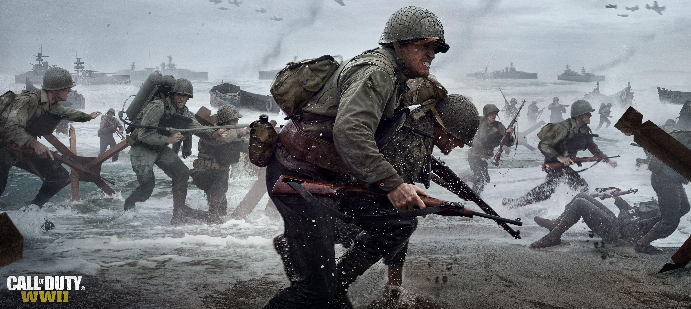

# Call of Duty: WWII Zombies FastFile Scripts

  

This repo contains scripts that I've extracted from the Call of Duty: WWII Zombies

## What's here?

* GSC scripts
* Map scripts
* Zombie AI
* Weapon scripts
* Utility functions
* UI scripts
* Various other extracted files

## Maps

* The Final Reich
* Gröesten Haus
* The Darkest Shore
* The Shadowed Throne
* The Tortured Path, C1, C2, C3
* Bodega Cervantes
* U.S.S. Mount Olympus
* Altar of Blood
* The Frozen Dawn

## Why?

If people are looking into WWII Zombies scripting or just curious how certain systems work.

## Notes

These are just WWII Zombies map specific scripts. 
So like Hidden Challenge Functions not like consumbles.

## Disclaimer

This repository is for research and educational purposes only.

All rights to Call of Duty: WWII and its assets belong to Activision and Sledgehammer Games. Nothing here is intended to replace ownership of the game.
